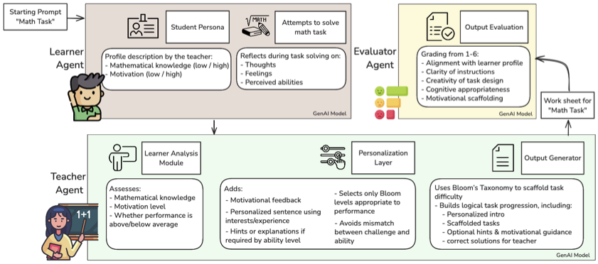

###bringing personalization into the classroom

If you’ve ever stood in front of a classroom knowing that some students are lost while others are bored, you’ve felt the central challenge of teaching: how do we reach everyone?
Personalization has become a central theme in education, promising learning tailored to each student’s needs. But most AI systems so far focus narrowly on knowledge and performance—adapting question difficulty or pacing—while overlooking other crucial factors such as motivation, self-confidence, and emotional engagement.

Our paper, FACET: Teacher-Centred LLM-Based Multi-Agent Systems — Towards Personalized Educational Worksheets, addresses that challenge. It presents a multi-agent large-language-model (LLM) framework that personalizes teaching materials according to students’ motivational and emotional attributes.

###Teacher-supporting AI systems

Most AI in education today is “student-facing”: chatbots that tutor, grade, or quiz. We argue that what’s missing is teacher-facing AI—systems that act as intelligent assistants, helping teachers design differentiated materials more efficiently.

The framework introduced in our paper is built around large language models (LLMs) and defines several specialised AI "roles" that collaborate.
There's a learner agent, which simulates a student with specific knowledge and motivational traits; a teacher agent, which generates a worksheet adapted to that profile; and an evaluator agent, which checks the quality and didactical soundness of the result.

The human teacher remains firmly in the loop, defining learner profiles and using or adjusting the generated worksheets.

###Modelling the learner — beyond test scores

Different learner profiles were modelled, each simulating a learner who “interacts” with the teacher agent by solving a sample task and expressing reasoning and affective cues such as frustration, curiosity, or enthusiasm. Based on this interaction, the teacher agent crafts a personalized worksheet that fits both the learner’s cognitive level and motivational needs.

### key aspects
Multi-agent architecture: Different agents handle content generation, student analysis, and quality assurance
Personalization: Adapts materials based on individual student characteristics and learning preferences 
Teacher-centred design: Empowers teachers with AI assistance while maintaining pedagogical control
Scalable framework: Can be adapted for different subjects and educational contexts

###Teacher-centred co-design

We integrated teachers into the development of the tool and conducted an initial, exploratory evaluation.
In interviews and open feedback, participating teachers were optimistic. They saw real potential for saving time in lesson preparation and for experimenting with differentiated materials they might not otherwise have the bandwidth to create. Many said they would welcome such a system as a “planning partner,” especially if it integrated smoothly into existing workflows.

They also pointed out areas for improvement: worksheets for the least motivated learners sometimes lacked engaging contexts or real-world relevance. 

### contribution

Together with teachers, we developed a teacher-centred, LLM-based multi-agent system to generate AI-supported personalized teaching materials. In doing so, we focus not only on performance but also on students’ motivational and affective aspects.

This study presents preliminary results demonstrating the feasibility of the FACET framework—a multi-agent AI architecture capable of producing individualized teaching materials that align with diverse learner needs. By modelling learners along cognitive and motivational dimensions and aligning outputs with established educational principles, the framework generated stable, high-quality worksheets, as confirmed through both agent-based evaluation and feedback from in-service K-12 teachers.

###interested in this work?
@misc{gonnermannmuller2025arxiv,
 archiveprefix = {arXiv},
 author = {Gonnermann-Müller, Jana and Haase, Jennifer and Fackeldey, Konstantin and Pokutta, Sebastian},
 eprint = {2508.11401},
 primaryclass = {cs.HC},
 title = {FACET: Teacher-Centred LLM-Based Multi-Agent Systems—Towards Personalized Educational Worksheets},
 url = {https://arxiv.org/abs/2508.11401},
 year = {2025}
}

---

*This research is part of our ongoing work in the 'Humans and AI' research area at Zuse Institute Berlin.*
